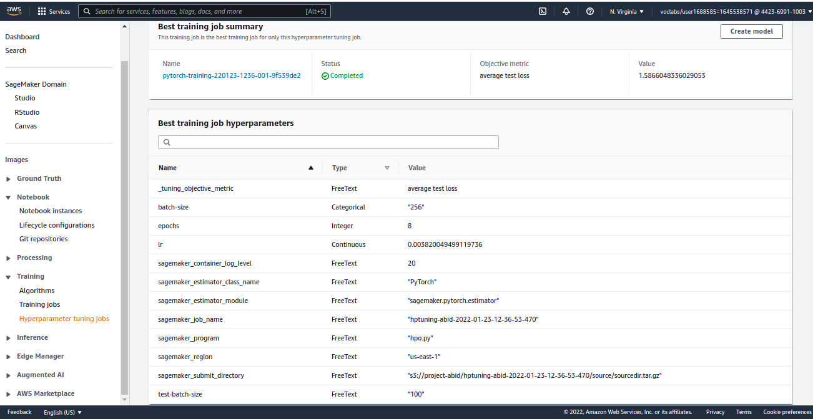
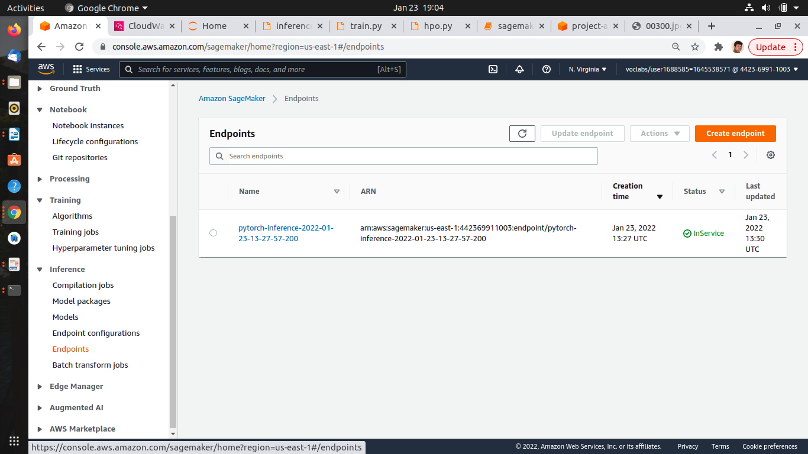
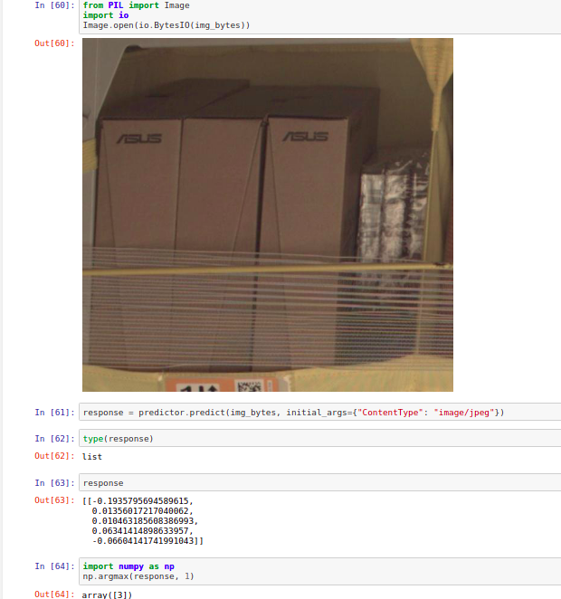

# Project Overview: Inventory Monitoring at Distribution Centers

This is a Deep learning project done as part of Udacity's capstone project of **AWS Machine Learning Engineer Nanodegree Program**.
Distribution centers often use robots to move objects as a part of their operations. Objects are carried in bins which can contain multiple objects. Occasionally, items are misplaced while being handled, so the contents of some bin images may not match the recorded inventory of that bin.

The proposed solution is to train and build a Deep Learning model using a pretrained model that can classify the image based on the number of objects in the bin. The input to the model is an image of a bin with the products in it and the output is list of predicted scores for each category type in this case the number of objects in the bin.

Here, I used AWS Sagemaker to train a pretrained model **resnet50** that can perform image classification. 


# Overview of the tasks

### AWS SageMaker Setup and installation

To build this project, you wlll have to use AWS through your classroom. Below are your main steps:
- Open AWS through the classroom on the left panel (**Open AWS Gateway**)
- Open SageMaker Studio and create a folder for your project

Create and open a Sagemaker instance, I have chosen 'ml.t2.medium' instance type. This instance comes with 2vCPUs and 4GiB memory. This configuration is good enough for running the project jupyter notebook and the price is also one of the least.
Then create or load the project files required to your workspace.

#### Download the Starter Files

You can clone this Github Repo or download the project files from Github and upload starter files to your workspace.

### Project files

#### Model Training Scripts (train.py / hpo.py / inference.py)

The training script takes the hyperparameters as arguments and reads, loads and preprocesses the train, test and validation datasets. Then after creating and loading the pretrained ‘resnet50’ model it trains the model using the given parameters.

hpo.py:  used for hyperparameter tuning job.

train.py: used for fine tuning the model with best hyperparameters.

inference.py: used for deploying the trained model.


#### SageMaker submission script (sagemaker.ipynb)

This jupyter notebook has the code cells to interface with the sagemaker and submit all the jobs to it. The following jobs are done using this script;

- Install necessary dependencies and import the libraries required

- Data download and preparation

- Upload the downloaded data to the required S3 bucket

- Setup the training estimator

- Submit the job

- Setup the Hyperparameter search space
    
- Setup the model debugging and profiling rules
    
- Create the model estimator for Hyperparameter tuning job

- Create the tuner for Hyperparameter tuning job
- Submit the tuning job
    
- Fetch the best training job and the hyperparameters

- Finetune the model with the best hyperparameters
    
- Deploy the model
    
- Query the model with a bin image and get prediction


#### Run the submission script (sagemaker.ipynb)

Run the code cells in the jupyter notebook to perform all the steps of the project.


## Dataset

Initial code cells of sagemaker.ipynb has the steps to data download and process.
For this project I will be using the <a href="https://registry.opendata.aws/amazon-bin-imagery/" target="_blank">Amazon Bin Image Dataset</a>.
The dataset contains 500,000 images of bins containing one or more objects. For each image there is a metadata file containing information about the image like the number of objects, it's dimension and the type of object.

Since this is a large dataset, I have used the provided code to download a small subset of that data.
The file_list.json has the list of files to download.

The dataset is split into train, test and validation directories in the ratio of 8:1:1.
The data that has been uploaded can be verified using the AWS S3 CLI or the S3 UI.


# Standout Suggestions

Here are some of the suggestions perfornmed to improve the project:

- Hyperparameter Tuning

- Model Deployment


## Hyperparameter Tuning
Here I used the 'resnet50' pretrained model for this experiment.

The hyperparameters and the ranges used are;

```
learning-rate: ContinuousParameter(0.001, 0.1)
batch-size:    CategoricalParameter([32, 64, 128, 256, 512])
epochs:        IntegerParameter(2,10)
test-batch-size: 100
```

**Screenshot of Hyperparameter tuning job**

    
### The best hyperparameters from all the training jobs are

```
  'test-batch-size': 100,
  'epochs': 8,
  'batch-size': 256,
  'lr': 0.003820049499119736
```

## Debugging and Profiling

__Summary from logs:__

```
modelVanishingGradient: NoIssuesFound

Overfit: NoIssuesFound

Overtraining: NoIssuesFound

PoorWeightInitialization: NoIssuesFound

LossNotDecreasing: NoIssuesFound

LowGPUUtilization: IssuesFound

ProfilerReport: IssuesFound
```


## Model Deployment

The model has been deployed using the PyTorchModel. For this I used a separate script 'inference.py'.

The endpoint can be queried using the code in the notebook. The test image needs to downloaded to the workspace directory and use the file location to fetch the image. Then preprocess the image and pass it to endpoint for prediction.

**Screenshot of the endpoint SageMaker**



## Querying the model endpoint

The endpoint can be queried using the predict() method of the predictor that was deployed.
Test image needs to be passed as below;


```
from PIL import Image
import io

def image_to_byte_array(image:Image):
  imgByteArr = io.BytesIO()
  image.save(imgByteArr, format=image.format)
  imgByteArr = imgByteArr.getvalue()
  return imgByteArr

img = Image.open("TestImgs/00010.jpg", mode='r')
img_bytes = image_to_byte_array(img)
type(img_bytes)


response = predictor.predict(img_bytes, initial_args={"ContentType": "image/jpeg"})
```

## Results

**Screenshot of the results**


